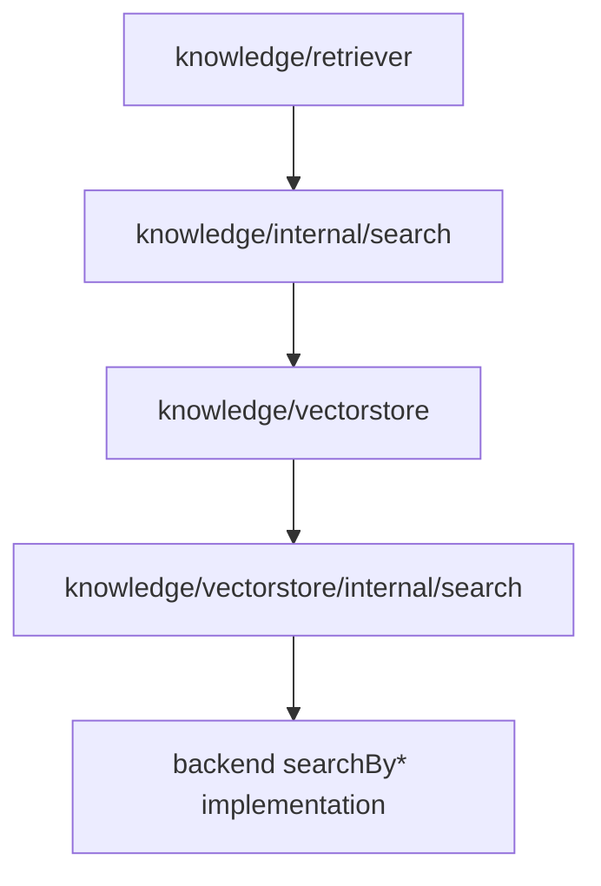

# Retrieval Layering

This page describes the retrieval layering that exists in the current codebase after the internal retrieval refactor. It is an implementation guide, not a new public API.

## Why This Layering Exists

The Knowledge stack has to solve two different orchestration problems:

1. `Retriever`-level orchestration:
   query rewrite, embedding, vector store recall, rerank, top-k
2. `VectorStore`-level orchestration:
   map `SearchMode` to vector/keyword/hybrid/filter execution

Those two problems now use the same retrieval terminology, but they live at different layers and own different responsibilities.

## The Four Layers

### 1. Generic Retrieval Core

Code:

- `internal/retrieval`

Owns:

- `Hit`
- `Branch`
- `Pipeline`
- `Channel`
- `Rewriter`
- `Reranker`
- `Fusion`
- `FallbackPolicy`
- `Merger`
- `Postprocessor`

Does not own:

- knowledge-specific request fields
- memory/session/knowledge scoring semantics
- SQL, RPC, embedding calls, or backend query builders

This layer is intentionally generic. It defines execution order and composition rules, but not domain behavior.

### 2. Knowledge Retrieval Assembly

Code:

- `knowledge/internal/search`
- `knowledge/retriever`

Owns:

- shaping `retriever.Query` into an internal retrieval `Request`
- converting `QueryFilter` into `vectorstore.SearchFilter`
- query enhancement and embedding as a `Rewriter`
- vector store recall as a `Channel`
- reranker adaptation as a `Reranker`
- top-k trimming as a `Postprocessor`

This layer answers the question:

> Given a user-facing knowledge query, how do we execute one knowledge retrieval branch?

### 3. VectorStore SearchMode Assembly

Code:

- `knowledge/vectorstore/internal/search`

Owns:

- adapting `vectorstore.SearchQuery` into retrieval `Request`
- adapting `vectorstore.SearchResult` into retrieval hits
- routing `SearchMode` to the correct pipeline
- applying mode-level postprocessing such as final top-k truncation

This layer answers the question:

> Given a vector store search request, which mode-specific path should run?

### 4. Backend Search Execution

Code:

- `knowledge/vectorstore/inmemory`
- `knowledge/vectorstore/sqlitevec`
- `knowledge/vectorstore/pgvector`
- `knowledge/vectorstore/tcvector`
- `knowledge/vectorstore/elasticsearch`
- `knowledge/vectorstore/qdrant`
- `knowledge/vectorstore/milvus`

Owns:

- `searchByVector`
- `searchByKeyword`
- `searchByHybrid`
- `searchByFilter`
- backend-specific validation
- SQL construction
- remote RPC requests
- score semantics
- backend fallback behavior when that behavior is implementation-specific

This layer is where real recall work happens.

## Execution Flow

The normal Knowledge retrieval flow is:

1. `knowledge/retriever.DefaultRetriever` builds a `knowledge/internal/search.Request`
2. `knowledge/internal/search.Branch` runs:
   - rewrite
   - recall
   - rerank
   - postprocess
3. `knowledge/internal/search.VectorStoreChannel` converts the request into `vectorstore.SearchQuery`
4. the selected vector store `Search()` method delegates mode routing to `knowledge/vectorstore/internal/search.ModePipeline`
5. the selected backend branch calls `searchByVector`, `searchByKeyword`, `searchByHybrid`, or `searchByFilter`
6. backend results are adapted back into retrieval hits
7. rerank and final top-k are applied at the knowledge layer

## Terminology Mapping

| Term | In Knowledge |
|------|--------------|
| `Request` | Internal execution envelope |
| `Branch` | One ordered retrieval path |
| `Pipeline` | A selectable or composable retrieval path |
| `Channel` | Candidate recall step |
| `Rewriter` | Query enhancement / embedding preparation |
| `Reranker` | Result reorder step |
| `Postprocessor` | Final trimming / sorting / dedup step |

## Ownership Rules

When changing or adding retrieval code, keep these rules:

- Put generic execution semantics in `internal/retrieval`
- Put knowledge-side request/result shaping in `knowledge/internal/search`
- Put `SearchMode` routing in `knowledge/vectorstore/internal/search`
- Keep backend query builders and scoring in the backend package
- Keep public API types in `knowledge/retriever` and `knowledge/vectorstore`

## Adding a New VectorStore Backend

For a new backend, prefer this structure:

1. implement backend-specific `searchByVector`
2. implement `searchByKeyword` if supported
3. implement `searchByHybrid` if supported
4. implement `searchByFilter`
5. wire `Search()` through `knowledge/vectorstore/internal/search.ModePipeline`
6. preserve backend-specific validation and fallback semantics inside the selected branch

This keeps naming and control flow consistent with the existing backends.
