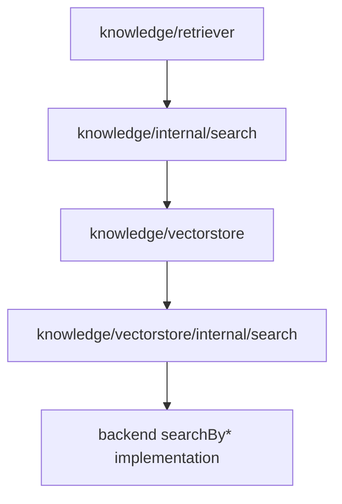

# 检索分层

这篇文档说明当前代码里已经落地的检索分层。它描述的是现有实现，不是新的对外 API 设计。

## 为什么要这样分层

Knowledge 栈里实际上有两类不同的编排问题：

1. `Retriever` 层编排：
   query rewrite、embedding、vector store recall、rerank、top-k
2. `VectorStore` 层编排：
   把 `SearchMode` 映射到 vector / keyword / hybrid / filter 执行路径

这两类问题现在使用同一套 retrieval 术语，但它们所处层次不同，职责也不同。

## 四层结构

### 1. 通用 Retrieval Core

代码位置：

- `internal/retrieval`

负责：

- `Hit`
- `Branch`
- `Pipeline`
- `Channel`
- `Rewriter`
- `Reranker`
- `Fusion`
- `FallbackPolicy`
- `Merger`
- `Postprocessor`

不负责：

- knowledge 专属请求字段
- memory/session/knowledge 的打分语义
- SQL、RPC、embedding 调用、backend query builder

这一层只定义执行顺序和组合规则，不定义领域行为。

### 2. Knowledge 检索装配层

代码位置：

- `knowledge/internal/search`
- `knowledge/retriever`

负责：

- 把 `retriever.Query` 组织成内部 `Request`
- 把 `QueryFilter` 转成 `vectorstore.SearchFilter`
- 以 `Rewriter` 形式执行 query enhancement 和 embedding
- 以 `Channel` 形式执行 vector store recall
- 以 `Reranker` 形式接入 reranker
- 以 `Postprocessor` 形式执行 top-k 截断

这一层回答的是：

> 给定一个用户侧 knowledge query，如何跑完一条 knowledge retrieval branch？

### 3. VectorStore SearchMode 装配层

代码位置：

- `knowledge/vectorstore/internal/search`

负责：

- 把 `vectorstore.SearchQuery` 适配成 retrieval `Request`
- 把 `vectorstore.SearchResult` 适配成 retrieval hits
- 根据 `SearchMode` 路由到正确的 pipeline
- 执行 mode 级别的后处理，例如最终 top-k 截断

这一层回答的是：

> 给定一个 vector store search request，应该选择哪条 mode-specific 路径？

### 4. Backend Search 执行层

代码位置：

- `knowledge/vectorstore/inmemory`
- `knowledge/vectorstore/sqlitevec`
- `knowledge/vectorstore/pgvector`
- `knowledge/vectorstore/tcvector`
- `knowledge/vectorstore/elasticsearch`
- `knowledge/vectorstore/qdrant`
- `knowledge/vectorstore/milvus`

负责：

- `searchByVector`
- `searchByKeyword`
- `searchByHybrid`
- `searchByFilter`
- backend-specific 参数校验
- SQL 构造
- 远端 RPC 请求
- 分数语义
- 后端实现特有的 fallback 行为

这一层才是真正执行 recall 的地方。

## 执行流程

Knowledge 检索的常规执行路径是：

1. `knowledge/retriever.DefaultRetriever` 构造 `knowledge/internal/search.Request`
2. `knowledge/internal/search.Branch` 依次执行：
   - rewrite
   - recall
   - rerank
   - postprocess
3. `knowledge/internal/search.VectorStoreChannel` 把请求转成 `vectorstore.SearchQuery`
4. 对应 vector store 的 `Search()` 再把 mode 路由交给 `knowledge/vectorstore/internal/search.ModePipeline`
5. 选中的 backend branch 调用 `searchByVector`、`searchByKeyword`、`searchByHybrid` 或 `searchByFilter`
6. backend 结果再被适配回 retrieval hits
7. 最后在 knowledge 层执行 rerank 和 top-k

## 术语映射

| 术语 | 在 Knowledge 中的含义 |
|------|-----------------------|
| `Request` | 内部执行请求载体 |
| `Branch` | 一条有序的检索路径 |
| `Pipeline` | 可选择或可组合的检索路径 |
| `Channel` | 候选召回步骤 |
| `Rewriter` | query enhancement / embedding 准备步骤 |
| `Reranker` | 结果重排步骤 |
| `Postprocessor` | 最终截断 / 排序 / 去重步骤 |

## 归属规则

新增或修改检索代码时，尽量遵循这些规则：

- 通用执行语义放在 `internal/retrieval`
- knowledge 侧的 request/result 适配放在 `knowledge/internal/search`
- `SearchMode` 路由放在 `knowledge/vectorstore/internal/search`
- backend query builder 和 scoring 留在各自 backend package
- public API 类型继续留在 `knowledge/retriever` 和 `knowledge/vectorstore`

## 新增 VectorStore Backend 的建议做法

新增后端时，优先沿用下面这个结构：

1. 实现 backend-specific `searchByVector`
2. 如果支持，实装 `searchByKeyword`
3. 如果支持，实装 `searchByHybrid`
4. 实装 `searchByFilter`
5. 在 `Search()` 里接入 `knowledge/vectorstore/internal/search.ModePipeline`
6. 把 backend-specific 的校验和 fallback 语义留在被选中的 branch 内部

这样可以让命名、控制流和现有后端保持一致。
